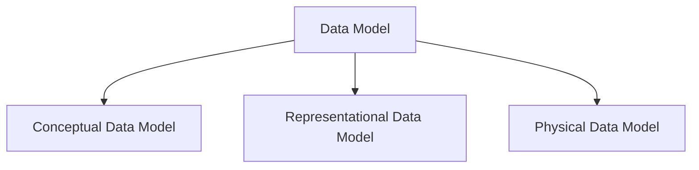
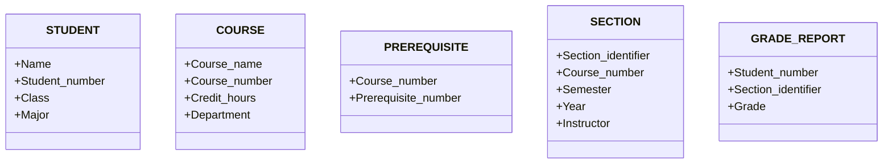

Date: 2024-10-15     Time: 19:41

> [!NOTE]
> Taking notes is  a time consuming process but it will help in making the idea stick . - worth it 
> 
> 

Status: #baby 

Tags : [[Computer Science]]  [[3 - tags/DBMS]] 

# Intro to Database management system

### Module 1 : Intro to database management 
- Databases are a neccessity as more and more of the world are becoming digital .

- ***Data*** : Facts concerning events that can be recorded and stored. - a stroed representation of objects and events that have meaning and importance in user's environment.

- ***Information*** : Data that has been processed in such a way inorder to increase the knowledge of a person .

- ***Metadata*** : data that describes a particular data .

- ***Database*** : Organized  colleciton of related data . - it is also called as the mini world (universe of discourse)

- ***Data base management system*** : A software that can be used to create, maintain and provide controlled access to user databases .

### Basic concepts and definitions

- ### Entities : 
	- These are similar to  nouns - describes a person , an object , an event or a concept in the business environment . 
	-  **Entity:** A real-world object or concept, represented as a table in a database.
	 • **Attributes:** Properties or details of an entity (columns in the table).
	 • **Entity Set:** A collection of similar entities (rows in the table).
	 • **Primary Key:** Uniquely identifies each entity in an entity set.
	 • **Relationship:** Defines how entities are related to each other.
	Example: “Student” as an entity with attributes like name, age, and ID.

- ### Relational database :
	• **Relational Database:** Data organized in **tables** (rows & columns).
	• **Primary Key:** Unique row identifier.
	• **Foreign Key:** Links between tables.
	• **SQL:** Language for querying/managing data.
	• **Normalization:** Reduces redundancy, ensures integrity.
	• **ACID:** Guarantees reliable transactions.
	  Examples: MySQL, PostgreSQL, SQL Server.

#### Databases vs file management system

| Feature                | DBMS                                  | File System                         |
|------------------------|---------------------------------------|-------------------------------------|
| **Data Redundancy**     | Minimizes redundancy through normalization | High redundancy, data duplication   |
| **Data Integrity**      | Ensures integrity via constraints     | Difficult to maintain integrity     |
| **Data Security**       | Provides better security and access control | Limited security                    |
| **Data Access**         | Easy querying via SQL                | Manual access and search required   |
| **Concurrent Access**   | Allows multi-user access with ACID support | Limited concurrent access, prone to conflicts |
| **Backup & Recovery**   | Automated backup & recovery mechanisms | Manual backup, risk of data loss    |
| **Data Consistency**    | Maintains consistency through transactions | Consistency hard to enforce         |

### Data base model 

A data model—a collection of concepts that can be used to describe the structure of a database—provides the necessary means to achieve this abstraction.

- It gives us a transparent picture of the database, which helps create the actual database.

#### Conceptual data model

- Very high level 
- They are used to understand the needs and requirements of the database.
- This model is used in the requirement-gathering process.
- Example - entity-relationship model 
- ###### ER model: high-level model used to define the data and the relationships between them.
- Components of ER Model  - ***Entity, attributes and relations***

#### Representational Data Model

This type of data model is used to represent only the **logical part** of the database and does not represent the physical structure of the database. The **representative data model** allows us to focus primarily on the **design** of the database. A popular representative model is the **Relational Model**.

The **Relational Model** consists of:

- **[[Relational Algebra]]**
- **[[Relational Calculus]]**

Data transformation is also done here, making it atomic or essential elements following well-established rules. For most databases, it is done with **normalization**.

In the Relational Model, tables represent data and the relationships between them. It is a theoretical concept whose practical implementation is done in the **Physical Data Model**.

The advantage of using a Representational Data Model is that it provides a **foundation** for the **Physical Model**.

#### Physical model 

Physical data models describe **how data is stored** as files in the computer by repre-
senting information such as record formats, record orderings, and access paths.

An **access path** is a structure that makes the search for particular database records effi-
cient.

**An index** is an example of an access path that allows direct access to data
using an index term or a keyword. 

It is similar to the index at the end of a book, except that it may be organized in a linear, hierarchical (tree-structured), or someother fashion.

### Systems development lifecycle

![[Pasted image 20241015222452.png]]
![[Pasted image 20241015222539.png]]

### Database Schema vs states 

| **Aspect**     | **Database Schema**                                            | **Database State**                                          |
| -------------- | -------------------------------------------------------------- | ----------------------------------------------------------- |
| **Definition** | Structure or blueprint of the database (tables, columns, etc.) | Current data stored in the database                         |
| **Nature**     | Static (does not change frequently)                            | Dynamic (changes with CRUD operations)                      |
| **Purpose**    | Organizes and defines how data is stored                       | Represents the actual data at a specific point              |
| **Includes**   | Tables, columns, relationships, data types, constraints        | The rows/records currently in the database                  |
| **Changes**    | Modified when schema design is updated                         | Changes frequently as data is inserted, updated, or deleted |
|                |                                                                |                                                             |

Note : database state is also called - database instance.
Schema is also called intension; state - extension

###### Example of a schema 

###### Example of a database state
![[Pasted image 20241015225222.png]]

## What is a database schema ?
- It is the skeleton of the database created by the attributes .
- It mentions the logical constraints like the table, primary key , etc.
- schema doesnt mention the data type of the attributes

| Patient           |
| ----------------- |
| Patient_id        |
| Patient_name      |
| Medicine_purchase |
so when we create the table - it will be like :

| Patient_id | Patient_name | Medicine_purchase |
| ---------- | ------------ | ----------------- |
| 001        | Pranav ajay  | Paracetamol, dolo |
| 002        | Punya ajay   | Gelusil           |

### The three schema architecture
![[Three-schema-architecture]]

#### External schema 
 Represents how different users view the data.
	- Different user groups require different views of the database 
	-  Examples:
		- User view 1:  Admin management of staffs.
		- User view 2 :  Registration view for receptionist.
		- User view 3:  Stock view for pharmacists.

#### Conceptual schema 
**Conceptual schema**  at the conceptual level to describe the structure and constraints for the whole database for a community of users.

**Example:**

**Entities**:
	• **Patients**: (Patient ID, Name, Age, Gender, Medical History)
	• **Staff**: (Staff ID, Name, Department, Role, Salary)
	• **Appointments**: (Appointment ID, Patient ID, Doctor ID, Date, Time)
	• **Medicines**: (Medicine ID, Name, Stock Level, Expiry Date)
	• **Prescriptions**: (Prescription ID, Patient ID, Medicine ID, Dosage)
 
**Relationships**:
	• Patients are linked to appointments with doctors.
	• Doctors write prescriptions for patients.
	• Pharmacists manage stock of medicines and issue them based on prescriptions.

 **Constraints**:
	• A patient must have at least one doctor assigned.
	• Medicine stock levels should not fall below a minimum threshold.
	• Each prescription must reference valid patients and available medicines.

#### Internal Schema
**Internal schema** at the internal level to describe physical storage structures and access paths (e.g indexes).

A **Physical schema** defines how data is stored physically in storage systems, using files and indices. It represents the actual code or syntax for creating the database structure. At this level, the Database Administrator (DBA) decides where and how to store data in storage blocks, optimizing for performance and space.

### The dbms languages
![[Pasted image 20241016020650.png]]

# References
Similar notes and source ideas
Geeks for geeks
Chat gpt 
[[Elmasri navathe's DBMS book]]
Karthik sir's ppt

